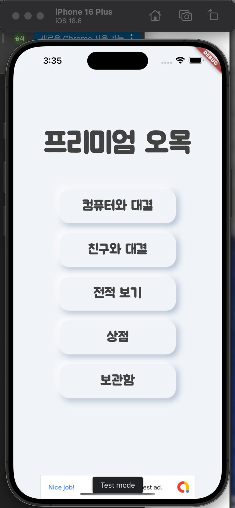
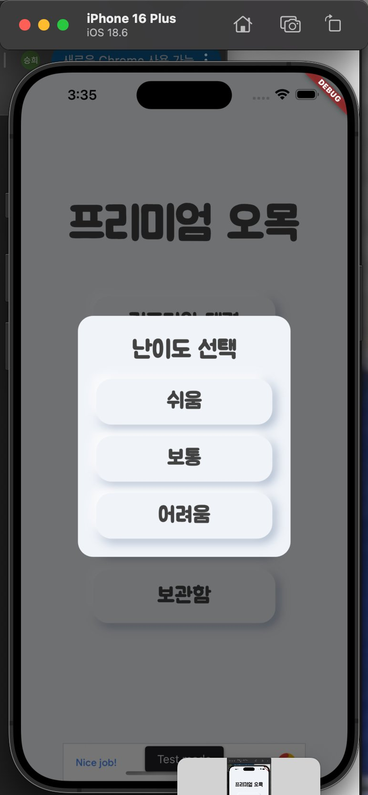
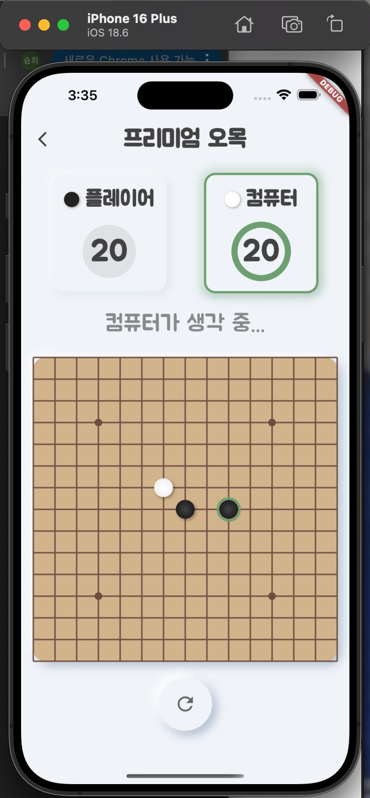
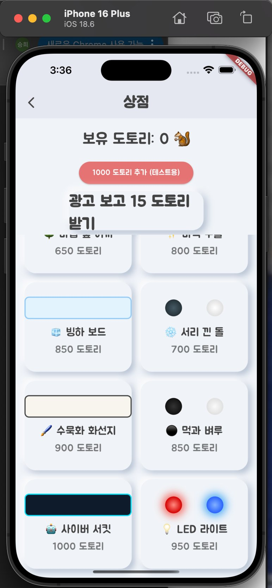
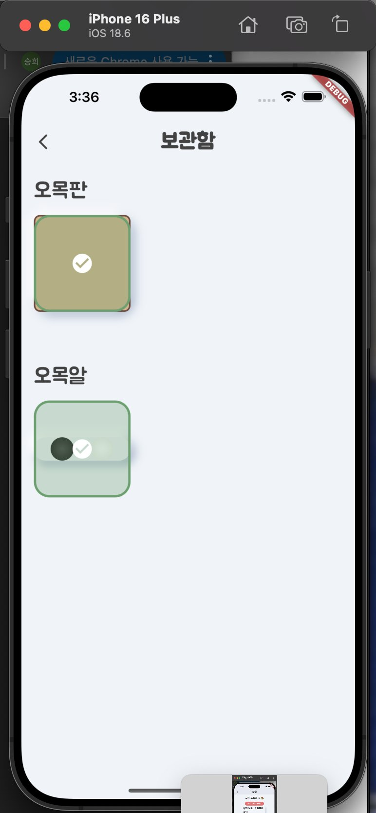

# 🎮 프리미엄 오목 (Premium Omok)

> **Flutter 기반 크로스플랫폼 모바일 오목 게임**  
> 커스텀 테마 · AI 대전 · 인앱 상점 · 광고 수익화를 갖춘 완성형 게임 앱

<br/>

## 📱 스크린샷

<table>
  <tr>
    <td align="center">
      <br/>
      <sub><b>메인 화면</b></sub>
    </td>
    <td align="center">
      <br/>
      <sub><b>난이도 선택</b></sub>
    </td>
    <td align="center">
      <br/>
      <sub><b>게임 플레이</b></sub>
    </td>
    <td align="center">
      <br/>
      <sub><b>테마 상점</b></sub>
    </td>
    <td align="center">
      <br/>
      <sub><b>보관함</b></sub>
    </td>
  </tr>
</table>

<br/>

---

## 📌 프로젝트 개요

| 항목 | 내용 |
|------|------|
| **프로젝트명** | 프리미엄 오목 (Premium Omok) |
| **플랫폼** | Android / iOS (Flutter 크로스플랫폼) |
| **유형** | 개인 프로젝트 |
| **역할** | 기획 · 설계 · 전체 개발 · 배포 (1인) |
| **주요 기술** | Flutter, Dart, Provider, Google Mobile Ads, SharedPreferences, GetIt |

단순한 오목 앱을 넘어, **커스텀 테마 시스템 · 3단계 AI · 도토리 경제 · 광고 수익화** 를 유기적으로 연결한 완성도 높은 모바일 게임입니다.

<br/>

---

## 💡 기획 배경

기존 모바일 오목 앱들의 한계를 직접 느끼고, 이를 해결하기 위해 프로젝트를 시작했습니다.

| 문제 | 해결 방향 |
|------|-----------|
| 획일적인 UI — 나무판/검은돌 고정 | 16종+ 커스텀 테마 & 특수 이펙트 상점 |
| AI 난이도 없음 — 랜덤 배치 수준 | 점수 기반 탐욕 알고리즘, 3단계 난이도 |
| 시간 제한 없어 긴장감 부재 | 20초 턴 타이머 + 카운트다운 UI |
| 수익 모델 미흡 | Banner / Interstitial / Rewarded 3종 AdMob 연동 |

<br/>

---

## 🚀 주요 기능

### 1. 게임 모드

```
PvC (컴퓨터 대전)  ───  쉬움 / 보통 / 어려움  3단계 AI 선택
PvP (친구 대결)    ───  같은 기기 2인 대전 + 20초 턴 타이머
```

<br/>

### 2. AI 로직 (`AILogic`)

> 단순 랜덤이 아닌 **점수 기반 탐욕(Greedy) 알고리즘** 구현

- **즉시 승리 수** 및 **즉시 차단 수**를 최우선 탐색
- 오픈 엔드(양쪽 열린 연속) 개념 도입 — 열린 3연속 > 닫힌 4연속 우선순위
- 난이도별 가중치 조정으로 체감 차별화

```dart
// 패턴별 점수 예시 (어려움 기준)
4연속 + 양 끝 열림  →  10,000점
3연속 + 양 끝 열림  →   2,000점
즉시 승리 수        →  50,000점 (최우선)
```

<br/>

### 3. 턴 타이머 & 애니메이션

- `PlayerIndicator` 위젯에 **20초 CircularProgressIndicator** 내장
- 5초 이하 → 빨간색 전환, 시간 초과 → 자동 턴 이관
- 돌 착수: **elastic 커브 스케일 애니메이션**
- 승리: 🎉 **Confetti 이펙트** / 패배: 🌧️ **RaindropAnimation**

<br/>

### 4. 커스텀 테마 상점

총 **16종 이상** 테마를 도토리로 구매·장착 가능합니다.

| 테마 | 가격 | 특수 효과 |
|------|------|-----------|
| 기본 나무판 / 조약돌 | 무료 | — |
| 🌸 벚꽃 나무판 | 100 | 벚꽃 꽃잎 플로팅 파티클 |
| 🌊 심해 석판 | 150 | 물방울 버블 상승 |
| 🌌 은하수 보드 | 500 | 별빛 반짝임 애니메이션 |
| 🧘 젠가든 모래판 | 450 | 낙엽 드리프팅 |
| 🌳 마법 숲 이끼 | 650 | 네온 글로우 라인 펄스 |
| 🧊 빙하 보드 | 850 | 아이스 시머 효과 |
| 🤖 사이버 서킷 | 1,000 | 사이버 네온 글로우 |
| 💎 다이아몬드 돌 | 750 | 스파클 이펙트 |
| ✨ 마력 구슬 | 800 | 소용돌이 에너지 회전 |
| 💡 LED 라이트 | 950 | 컬러 발광 그림자 |

<br/>

### 5. 도토리 경제 시스템

```
PvC 승리          →  +10 도토리 자동 지급
보상형 광고 시청   →  +15 도토리 지급
도토리 사용        →  상점에서 테마 구매
```

- `SharedPreferences`로 재화·보유 아이템·장착 상태 **영구 저장**

<br/>

### 6. Google Mobile Ads 수익화

| 광고 유형 | 위치 | 동작 |
|-----------|------|------|
| Banner Ad | 메인 화면 하단 | 앱 실행 시 자동 로드 |
| Interstitial Ad | 게임 종료 → 메인 이동 시 | 전면 광고 삽입 |
| Rewarded Ad | 상점 도토리 획득 버튼 | 시청 완료 시 보상 지급 |

<br/>

---

## 🗂️ 아키텍처

### 디렉토리 구조

```
lib/
├── main.dart                   # 앱 진입점 — Provider 등록, AdMob 초기화
├── providers/
│   └── game_provider.dart      # GameProvider (ChangeNotifier) — 게임 상태 단일 관리
├── models/
│   ├── game_models.dart        # AILogic, Player enum, Difficulty enum
│   └── item_models.dart        # CustomItem, BoardTheme, StoneTheme, 상점 목록
├── screens/
│   ├── main_screen.dart        # 메인 메뉴
│   ├── game_screen.dart        # 게임 플레이
│   ├── store_screen.dart       # 인앱 상점
│   ├── inventory_screen.dart   # 보관함·장착
│   └── stats_screen.dart       # 전적 통계
├── widgets/
│   ├── board_painter.dart      # CustomPainter — Canvas 기반 보드 렌더링
│   ├── custom_widgets.dart     # NeumorphicButton, PlayerIndicator (타이머)
│   └── effects.dart            # RaindropAnimation
└── services/
    ├── player_data.dart        # SharedPreferences — 재화·아이템 저장
    ├── game_stats.dart         # SharedPreferences — 전적 저장
    └── locator.dart            # GetIt 서비스 로케이터
```

<br/>

### 상태 관리 — Provider 패턴

```
┌──────────────────────────────────────────┐
│             GameProvider                 │
│  • 보드 상태 / 현재 플레이어 / 게임오버   │
│  • 현재 테마 (BoardTheme / StoneTheme)   │
│  • 광고 객체 (Interstitial)              │
│  • reloadTheme() → notifyListeners()     │
└──────────┬───────────────────────────────┘
           │ context.watch / context.read
  ┌────────┴──────────────────────┐
  │  GameScreen  │  InventoryScreen │  ...
  └──────────────────────────────┘

GetIt Locator
  ├── PlayerDataService  (싱글톤)
  └── GameStats          (싱글톤)
```

<br/>

### CustomPainter 레이어링

```
Canvas 드로잉 순서:
  1. 보드 배경 (BoardTheme.boardColor)
  2. 보드 특수 이펙트 (galaxy_stars / cherry_blossom / ...)
  3. 격자선 (일반 / glowing_lines 모드)
  4. 화점 (5개 고정 위치)
  5. 돌 (그림자 → 그라디언트 → 돌 이펙트)
  6. 착수 강조 링 (lastMove)
  7. 승리 돌 하이라이트
  8. 승리 라인 드로우 애니메이션
```

**애니메이션 2채널 분리:**
- `placementAnimationValue` — 착수 elastic 스케일 (300ms, 1회)
- `continuousAnimationValue` — 지속 이펙트 루프 (3s, repeat)

<br/>

---

## 🛠️ 기술 스택

| 영역 | 기술 | 용도 |
|------|------|------|
| UI 프레임워크 | Flutter / Dart | 크로스플랫폼 모바일 앱 |
| 상태 관리 | Provider (ChangeNotifier) | 게임 상태 중앙 관리 |
| 서비스 로케이터 | get_it | 서비스 싱글톤 DI |
| 로컬 저장소 | shared_preferences | 재화·아이템·전적 영구 저장 |
| 광고 수익화 | google_mobile_ads | Banner / Interstitial / Rewarded |
| 애니메이션 | confetti | 승리 콘피티 이펙트 |
| 폰트 | google_fonts (Jua) | 한국어 게임 감성 타이포 |
| 렌더링 | CustomPainter | Canvas 직접 드로잉 |

<br/>

---

## 🔧 핵심 구현 포인트 & 트러블슈팅

### 📌 AI 스코어링 튜닝

처음엔 연속 개수만 점수화했더니 '어려움' AI도 쉽게 졌습니다.  
**오픈 엔드 개념을 도입**해 양쪽 열린 3연속을 닫힌 4연속보다 높게 평가하고, 난이도별 가중치를 조정해 체감 차이를 만들었습니다.

<br/>

### 📌 타이머 & 게임 상태 동기화

`PlayerIndicator` 내부 타이머가 게임 오버 후에도 계속 돌아 `onTimeout` 콜백이 중복 발화되는 버그가 있었습니다.  
`didUpdateWidget`에서 `isTurn` 변화를 감지해 타이머를 cancel/restart하고, `_isDialogShowing` 플래그로 다이얼로그 중복 노출을 방지했습니다.

<br/>

### 📌 테마 실시간 동기화

보관함에서 테마를 변경해도 이미 생성된 `GameProvider`가 이전 테마를 참조하는 문제가 있었습니다.  
`_equipItem` 완료 후 `context.read<GameProvider>().reloadTheme()`을 명시 호출해 `notifyListeners`를 트리거, 게임 화면에 즉시 반영되도록 처리했습니다.

<br/>

### 📌 CustomPainter 성능 최적화

```dart
// 두 애니메이션 컨트롤러를 하나의 AnimatedBuilder에 묶어
// 위젯 트리 rebuild 없이 Canvas만 재드로잉
AnimatedBuilder(
  animation: Listenable.merge([
    _stonePlacementController,
    _continuousEffectController,
  ]),
  builder: (context, child) => CustomPaint(painter: BoardPainter(...)),
)
```

<br/>

---

## 📊 성과 및 배운 점

### 성과

- ✅ Flutter 크로스플랫폼 — Android/iOS 단일 코드베이스 완성
- ✅ 16종+ 테마 / 7종 특수 이펙트 CustomPainter 직접 구현
- ✅ AI · 타이머 · 광고 · 도토리 경제 루프 유기적 연결
- ✅ Provider + GetIt 조합으로 스크린 간 상태 일관성 유지

### 배운 점

- **CustomPainter 심층 이해** — Flutter 렌더링 파이프라인(Canvas, Paint, Layer) 직접 경험
- **게임 AI 설계** — 탐욕 알고리즘의 한계와 도메인 특화 휴리스틱 튜닝 방법
- **ChangeNotifier 패턴** — 복잡한 게임 상태 관리에서의 강점과 과도한 `notifyListeners` 호출의 위험성
- **AdMob 생명주기** — load → show → dismiss → reload 전체 사이클 직접 관리

<br/>

---

## 🗺️ 향후 개선 계획

- [ ] **온라인 멀티플레이** — Firebase Realtime Database 기반 실시간 대전
- [ ] **렌주 룰** — 흑돌 3-3, 4-4, 장목 금지 규칙 AI에 추가
- [ ] **AI 고도화** — Minimax + Alpha-Beta Pruning 업그레이드
- [ ] **글로벌 랭킹** — Firebase Firestore 기반 승률 리더보드
- [ ] **시즌 이벤트 테마** — 기간 한정 테마로 재방문 유도

<br/>

---

*Flutter · Dart · Provider · Google Mobile Ads · GetIt · SharedPreferences*
